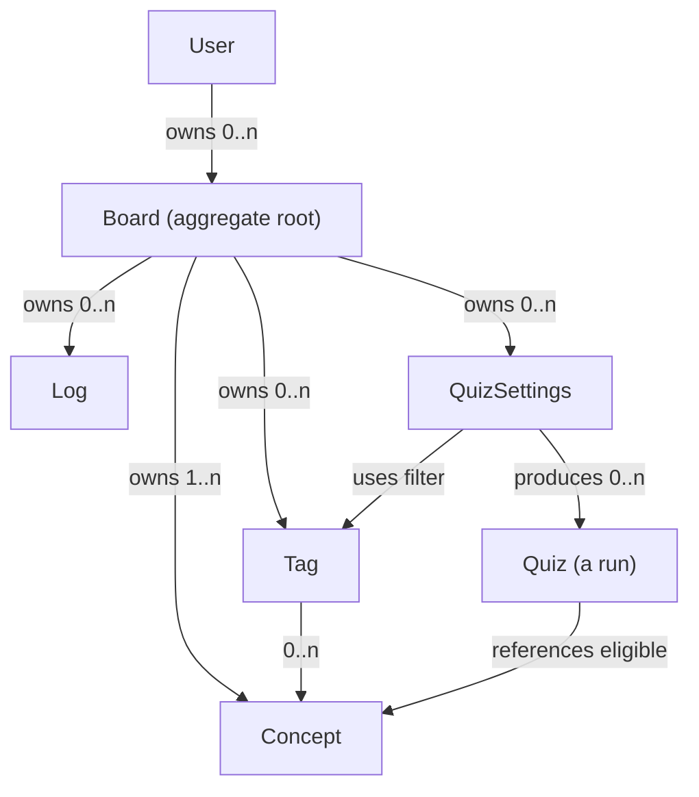
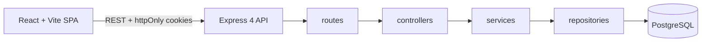

# Learning Logs Revamped — Software Design Document

Status: Draft (collaborative — iterate with William)
Last updated: 2026-08-03

---

## 1. Overview

Learning Logs is a personal learning platform. Users capture **concepts** (question + answer pairs tagged with keywords) as they study, keep **logs** describing their learning journey, and get **quizzed** on what they've learned. The app is built to practice prompt engineering, double as a portfolio piece, and be usable day-to-day with potential for real users.

---

## 2. Goals & Non-Goals

### Goals
- Capture concepts (Q&A + hint) with identifying tags.
- Organize learning into boards (per-topic groups of tags, concepts, logs, quizzes).
- Quiz yourself across a whole board or a tag-filtered subset.
- Track per-concept mastery so known concepts drop out of quizzes unless explicitly included.
- Record quiz history so the breakdown (which answers were right/wrong) is reviewable.
- Work as a portfolio-quality, real-user-capable product.

### Non-Goals (for now)
- Board sharing / collaboration (design for private boards, single owner).
- Advanced analytics beyond per-concept correct counts and quiz summaries.
- Mobile apps; the SPA should be responsive but is web-first.

---

## 3. Domain Model

### Ownership & Encapsulation
The **Board is the aggregate root**. A user owns boards; each board fully encapsulates its concepts, tags, logs, and quizzes. Nothing outside the board reaches into those resources directly — they are always addressed through the board.



### Key Entities

| Entity | Notes |
|---|---|
| **User** | Owns boards. Auth via password (bcrypt) with email verification. |
| **Board** | Aggregate root. Has a `mastery_threshold` — how many correct answers a concept needs to be labeled "known". |
| **Concept** | Exactly one board. Fields: prompt (question), answer, hint (optional), `times_answered_correctly`. |
| **Tag** | Belongs to a board. Many-to-many with concepts (a tag tags 0..n concepts). |
| **Log** | Belongs to a board. Free-form learning journal entries. |
| **QuizSettings** | Belongs to a board. A saved quiz definition (name, style, optional tag filter, `include_known`). Settings only — not a run. |
| **Quiz** | A single attempt/run. Records questions count, time elapsed, correct count. Optionally linked to a QuizSettings (NULL for one-off quizzes). |
| **QuizQuestion** | One question in a quiz (run). References a concept + whether it was answered correctly. |

### Quiz Lifecycle (hybrid)
- **One-off quiz**: created on the fly from current settings, produces a **Quiz** row with `quiz_settings_id = NULL`, not saved as settings.
- **Saved quiz**: persisted as **QuizSettings**. Can be run repeatedly; each run is a new **Quiz** row.
- **Load → edit**: a saved QuizSettings can be loaded and edited. Editing produces a one-off (unless the user chooses to update the saved settings).

---

## 4. System Architecture



- **Frontend**: React + Vite SPA (separate package in `frontend/`).
- **Backend**: existing Express 4 layered architecture in `backend/` (routes → controllers → services → repositories) — extended with the domain resources.
- **DB**: PostgreSQL via `pg.Pool` (`backend/db/pool.js`).
- **Auth**: JWT access (1h) + refresh (30d) in httpOnly cookies; bcrypt for passwords with email verification. Already implemented.

### Authorization Boundary
The `authenticate` middleware (already built) resolves the user. A new `requireBoardAccess` middleware loads the board and verifies `board.user_id === req.userId` before any child-resource route. This keeps access control at the aggregate root.

Ownership is enforced as **defense in depth** at two layers:
1. `requireBoardAccess` rejects requests to another user's board at the route level.
2. Every board-scoped repository query additionally filters by owner in SQL (see Section 12), so a user can never touch another user's boards even if middleware is bypassed.

---

## 5. Tech Stack

| Layer | Choice | Status |
|---|---|---|
| Backend runtime | Node.js + Express 4 | Done |
| Layering | routes → controllers → services → repositories | Done |
| Database | PostgreSQL + `pg` Pool | Done |
| Password hashing | bcryptjs | Done |
| Tokens | jsonwebtoken (access 1h / refresh 30d, httpOnly cookies) | Done |
| Frontend | React + Vite SPA | Not started |
| HTTP client | `fetch` with `credentials: 'include'` (cookies) | Not started |

---

## 6. Database Schema (proposed)

All primary keys and foreign keys are **UUIDs** (`gen_random_uuid()`, built into PostgreSQL 13+). Every board-scoped query verifies the owner in SQL — see Section 12.

```sql
-- existing (id changed from SERIAL to UUID)
CREATE TABLE users (
  user_id       UUID PRIMARY KEY DEFAULT gen_random_uuid(),
  email         TEXT NOT NULL UNIQUE,
  password_hash TEXT,
  email_verified BOOLEAN NOT NULL DEFAULT false,
  password_it   INT NOT NULL DEFAULT 1,
  created_at    TIMESTAMPTZ NOT NULL DEFAULT now()
);

-- new
CREATE TABLE boards (
  board_id          UUID PRIMARY KEY DEFAULT gen_random_uuid(),
  user_id           UUID NOT NULL REFERENCES users(user_id) ON DELETE CASCADE,
  name              TEXT NOT NULL,
  mastery_threshold INT NOT NULL DEFAULT 3,
  created_at        TIMESTAMPTZ NOT NULL DEFAULT now()
);

CREATE TABLE concepts (
  concept_id              UUID PRIMARY KEY DEFAULT gen_random_uuid(),
  board_id                UUID NOT NULL REFERENCES boards(board_id) ON DELETE CASCADE,
  prompt                  TEXT NOT NULL,
  answer                  TEXT NOT NULL,
  hint                    TEXT,
  times_answered_correctly INT NOT NULL DEFAULT 0,
  created_at              TIMESTAMPTZ NOT NULL DEFAULT now(),
  updated_at              TIMESTAMPTZ NOT NULL DEFAULT now()
);

CREATE TABLE tags (
  tag_id    UUID PRIMARY KEY DEFAULT gen_random_uuid(),
  board_id  UUID NOT NULL REFERENCES boards(board_id) ON DELETE CASCADE,
  name      TEXT NOT NULL,
  created_at TIMESTAMPTZ NOT NULL DEFAULT now(),
  UNIQUE (board_id, name)
);

CREATE TABLE concept_tags (
  concept_id UUID NOT NULL REFERENCES concepts(concept_id) ON DELETE CASCADE,
  tag_id     UUID NOT NULL REFERENCES tags(tag_id) ON DELETE CASCADE,
  PRIMARY KEY (concept_id, tag_id)
);

CREATE TABLE logs (
  log_id     UUID PRIMARY KEY DEFAULT gen_random_uuid(),
  board_id   UUID NOT NULL REFERENCES boards(board_id) ON DELETE CASCADE,
  title      TEXT NOT NULL,
  content    TEXT NOT NULL,
  created_at TIMESTAMPTZ NOT NULL DEFAULT now(),
  updated_at TIMESTAMPTZ NOT NULL DEFAULT now()
);

-- saved quiz definitions (settings only, not a run)
CREATE TABLE quiz_settings (
  quiz_settings_id UUID PRIMARY KEY DEFAULT gen_random_uuid(),
  board_id         UUID NOT NULL REFERENCES boards(board_id) ON DELETE CASCADE,
  name             TEXT NOT NULL,
  style            TEXT NOT NULL CHECK (style IN ('true_false', 'multiple_choice', 'fill_in')),
  include_known    BOOLEAN NOT NULL DEFAULT false,
  created_at       TIMESTAMPTZ NOT NULL DEFAULT now(),
  updated_at       TIMESTAMPTZ NOT NULL DEFAULT now()
);

CREATE TABLE quiz_settings_tags (
  quiz_settings_id UUID NOT NULL REFERENCES quiz_settings(quiz_settings_id) ON DELETE CASCADE,
  tag_id           UUID NOT NULL REFERENCES tags(tag_id) ON DELETE CASCADE,
  PRIMARY KEY (quiz_settings_id, tag_id)
);

-- an actual quiz attempt/run
CREATE TABLE quiz (
  quiz_id           UUID PRIMARY KEY DEFAULT gen_random_uuid(),
  quiz_settings_id  UUID REFERENCES quiz_settings(quiz_settings_id) ON DELETE SET NULL,
  questions_count   INT NOT NULL,
  time_elapsed_ms   BIGINT NOT NULL,
  correct_count     INT NOT NULL,
  created_at        TIMESTAMPTZ NOT NULL DEFAULT now()
);

CREATE TABLE quiz_questions (
  quiz_question_id  UUID PRIMARY KEY DEFAULT gen_random_uuid(),
  quiz_id           UUID NOT NULL REFERENCES quiz(quiz_id) ON DELETE CASCADE,
  concept_id        UUID NOT NULL REFERENCES concepts(concept_id) ON DELETE CASCADE,
  answered_correctly BOOLEAN NOT NULL
);
```

Notes / open questions:
- `quiz_questions` references a **quiz** (a run), not the settings, so saved settings can be run many times with independent per-question results. One-off quizzes have `quiz_settings_id = NULL`.
- `time_elapsed_ms` as BIGINT; the quiz endpoint computes it server-side from timestamps.
- Consider a `known_at`/mastery history table later if mastery needs to be time-aware (not in v1).

---

## 7. API Design (proposed)

All routes require the access-token cookie except the auth routes.

| Method | Path | Purpose |
|---|---|---|
| POST | `/auth/register`, `/auth/login`, `/auth/logout`, `/auth/refresh` | Auth (done) |
| GET/PUT/DELETE | `/users/me` | Current user (done) |
| GET | `/boards` | List my boards |
| POST | `/boards` | Create board |
| GET/PUT/DELETE | `/boards/:boardId` | Board detail / update / delete |
| GET | `/boards/:boardId/concepts` | List concepts (optionally `?tag=`) |
| POST | `/boards/:boardId/concepts` | Create concept |
| GET/PUT/DELETE | `/boards/:boardId/concepts/:conceptId` | Concept detail / update / delete |
| GET | `/boards/:boardId/tags` | List tags |
| POST | `/boards/:boardId/tags` | Create tag |
| GET/PUT/DELETE | `/boards/:boardId/tags/:tagId` | Tag detail / update / delete |
| PUT/DELETE | `/boards/:boardId/concepts/:conceptId/tags/:tagId` | Link/unlink tag ↔ concept |
| GET | `/boards/:boardId/logs` | List logs |
| POST | `/boards/:boardId/logs` | Create log |
| GET/PUT/DELETE | `/boards/:boardId/logs/:logId` | Log detail / update / delete |
| GET | `/boards/:boardId/quiz-settings` | List saved quiz settings |
| POST | `/boards/:boardId/quiz-settings` | Save quiz settings |
| GET/PUT/DELETE | `/boards/:boardId/quiz-settings/:quizSettingsId` | Settings detail / update / delete |
| POST | `/boards/:boardId/quiz-settings/:quizSettingsId/quizzes` | Record a quiz (run) from these settings |
| GET | `/boards/:boardId/quiz-settings/:quizSettingsId/quizzes` | List quizzes (runs) for these settings |
| GET | `/boards/:boardId/quiz-settings/:quizSettingsId/quizzes/:quizId` | Quiz breakdown (per-question results) |

Question generation happens **server-side** (a service), so the client just submits `{ style, tagIds?, includeKnown? }` and receives questions.

---

## 8. Quiz Engine

### Question styles
- **True/False**: the question's prompt is shown with a candidate answer (the real answer, or a distractor); the user marks whether it's correct.
- **Multiple Choice**: prompt + 4 options (1 correct answer + 3 distractors).
- **Fill-in**: prompt only; the user types an answer; matching is lenient.

### Distractor selection (MCQ / T/F)
- Wrong options come from **other concepts' answers in the same board**.
- **Eligibility rule**: a distractor may only come from concepts that are themselves eligible to appear in this quiz — i.e., same board, matching the quiz's tag filter (if any), and not excluded by the known-concept filter. This prevents answer leakage from concepts outside the current quiz scope.

### Concept eligibility (what gets quizzed)
- Concepts in the board where `times_answered_correctly < board.mastery_threshold` (i.e., not yet "known").
- If the quiz has a tag filter, only concepts carrying at least one selected tag.
- `include_known: true` lifts the known-concept exclusion.

### Fill-in matching (lenient)
- Normalize both sides (trim, lowercase).
- Exact match counts as correct.
- Otherwise apply fuzzy matching (e.g., Levenshtein distance ≤ threshold relative to answer length) to accept minor typos.
- Exact algorithm is an open question — see Section 10.

### Run recording
When a quiz completes, the API persists:
- `quiz`: counts + elapsed time + correct count, linked to its `quiz_settings_id` (NULL for one-off).
- `quiz_questions`: one row per question (concept + right/wrong).
- Increment `concepts.times_answered_correctly` for each correctly answered concept (and consider decrement/limit on wrong answers — open question).

---

## 9. Auth & Security

Already implemented and unchanged:
- bcrypt password hashing (cost 10).
- JWT access token (1h) + refresh token (30d), separate secrets.
- Both tokens live only in httpOnly, `sameSite: lax` cookies (`secure` in production). Never in bodies or localStorage.
- Logout clears both cookies; refresh mints a fresh access token.
- Email verification is required at signup (stateless JWT codes); all accounts sign in with email + password.
- HTTP responses never expose `password_hash` — only `user_id` (+ safe fields).

New: `requireBoardAccess` middleware enforces board ownership for all board-scoped routes.

---

## 10. Open Questions

1. **Fill-in fuzzy threshold** — exact Levenshtein distance vs. a library (e.g., `string-similarity`, `fast-levenshtein`), and what tolerance.
2. **Wrong-answer effect on mastery** — should `times_answered_correctly` decrease on wrong answers, or only ever increase?
3. **One-off quiz settings** — a one-off quiz stores `quiz_settings_id = NULL`, so the settings used aren't preserved. Do we want to keep an immutable snapshot of the settings (or question set) for one-off quizzes too?
4. **Deleted concepts in quiz history** — if a concept is deleted, should old quizzes keep a snapshot of the question text, or just the concept id (foreign key)?
5. **Mastery history** — is per-concept time-series mastery (when each correct answer happened) needed in v1, or just the running count?
6. **Deployment target** — local only for now, or a planned host (affects `secure` cookie config, CORS origins).

---

## 11. Roadmap

1. **Boards** — schema, repositories, services, controllers, routes, `requireBoardAccess`.
2. **Concepts + Tags** — CRUD, tag linking, tag-filtered queries.
3. **Logs** — CRUD.
4. **Quiz engine v1** — eligibility + distractor service, true/false + MCQ + fill-in, run recording, mastery increments.
5. **Frontend (React + Vite)** — auth screens, board dashboard, concept/tag/log management, quiz runner, results views.
6. **Polish** — responsive design, seed data, tests, deployment.

---

## 12. Implementation Notes

- Backend stays CommonJS (`require`/`module.exports`), consistent with the existing scaffold.
- **All identifiers are UUIDs** — `UUID PRIMARY KEY DEFAULT gen_random_uuid()` on every table, with UUID foreign keys. JWT `userId` claims carry the UUID string; route params are UUIDs.
- **Naming**: a saved quiz definition is a `quiz_settings` row (`quiz_settings_id`); an actual attempt is a `quiz` row (`quiz_id`). The old `quiz_runs` name is gone.
- Each new resource follows the established pattern: repository (SQL only) → service (rules/validation) → controller (HTTP) → route.
- Board-scoped repositories take `userId` + `boardId` as part of identity and **verify ownership in SQL**. Reads join through the owning board, e.g.:
  ```sql
  SELECT c.*
  FROM concepts c
  JOIN boards b ON b.board_id = c.board_id
  WHERE c.concept_id = $1 AND c.board_id = $2 AND b.user_id = $3;
  ```
  Writes (UPDATE/DELETE) use the same `b.user_id = $3` filter so no row outside the user's boards is ever modified, regardless of middleware.
- Frontend talks to the API with `fetch(..., { credentials: 'include' })` so cookies are sent automatically.
